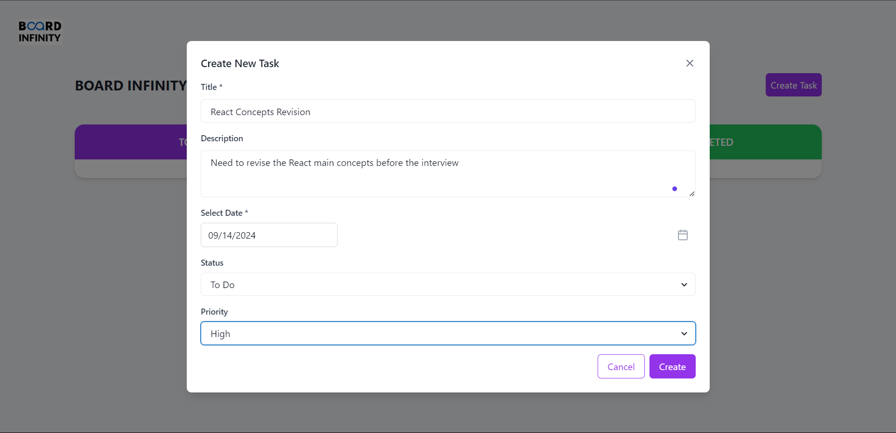
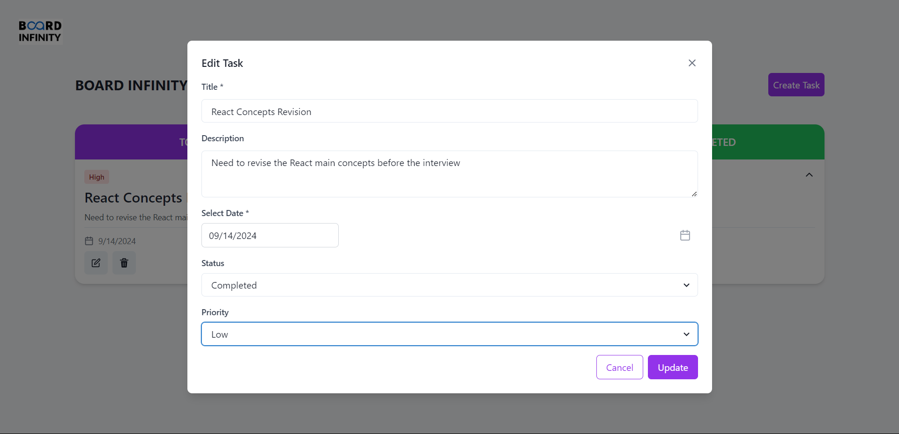
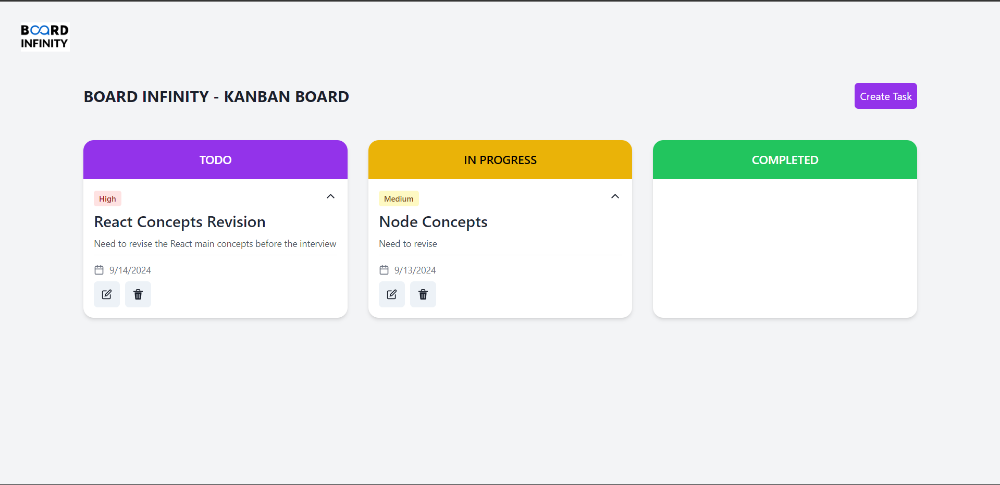

# Board-Infinity - Kanban-Board

## Overview

🌟✨ A Kanban board is a visual tool for managing workflow by displaying tasks as cards moving through columns representing different stages, such as "To Do," "In Progress," and "Done." It helps teams track progress, limit work-in-progress, and identify bottlenecks. By focusing on continuous delivery and visualizing the work process, Kanban improves efficiency and productivity.✨🌟


### Click  [https://board-infinity-kanban-board.vercel.app/](https://board-infinity-kanban-board.vercel.app/) to view in your browser. 🌐👀

### UI Reference
[https://www.figma.com/design/LvIrJ2fcRNabf8UHMjBHJW/Front-End-Task?node-id=0-1&node-type=CANVAS&t=FsM3zcjq2IXdSHWn-0](https://www.figma.com/design/LvIrJ2fcRNabf8UHMjBHJW/Front-End-Task?node-id=0-1&node-type=CANVAS&t=FsM3zcjq2IXdSHWn-0)


## Features

- **Create a webpage listing all tasks in columns:** The Kanban board will have three columns: TODO, IN PROGRESS, and COMPLETED. Tasks will be displayed in their respective columns based on their status.

- **Implement functionality to add new tasks with selected status:** Users will be able to add new tasks to the Kanban board and select the initial status for each task.

- **Include a Modal/Popup/Dialog with a form for task creation:** A modal, popup, or dialog will be used to display a form for creating new tasks. Users can enter the task details and select the status before adding it to the Kanban board.

- **Enable editing of existing tasks:** Users will have the ability to edit the details of existing tasks on the Kanban board. They can modify the task title, description, due date, status, and priority.

- **Implement task deletion feature:** Users will be able to delete tasks from the Kanban board. A delete icon or button will be provided for each task, allowing users to remove tasks they no longer need.

- **Allow changing task status to move between columns (Drag and Drop ):** Users can change the status of a task by dragging and dropping it between the columns on the Kanban board. This feature provides a visual way to move tasks from one stage to another.


## Technologies Used

- **React:** ⚛️ A JavaScript library for building user interfaces.
- **Tailwind CSS:** 🎨 A utility-first CSS framework for rapid UI development.
- **Chakra UI:** 💎 A simple, modular, and accessible component library for React.
- **Lucide React:** 🌈 An icon library that added visual clarity to the task cards.
- **react-datepicker:** 📅 A flexible and customizable datepicker component for React.
- **react-dnd:** 🎯 A set of React utilities for building.
- **react-dnd-html5-backend:** 🌐 A HTML5 backend for React DnD that uses the HTML5 drag and drop API.


## Setup and Installation for Frontend

1. **Clone the repository**
    ```bash
    git clone https://github.com/Faizankhan298/Board-Infinity_Kanban_Board.git
2. **Navigate to the project directory**

    ```bash
    cd Board-Infinity_Kanban_Board
3. **Install dependencies**

    ```bash
    npm install 
4. **Start the application**

    ```bash
    npm run dev
    
The frontend will start running on http://localhost:5173. 🚀🌐


## Images

1. **Homepage**
    - **To Do:** Start by adding tasks that you plan to work on. This is where you list all your upcoming tasks.
    - **In Progress:** Move tasks here when you begin working on them. This column helps you focus on your current work.
    - **Completed:** Once tasks are finished, drag them to this column to track your achievements and review completed work.
    

2. **Create-Task**
    - **Title:** Enter the title of the task.
    - **Description:** Provide a brief description of the task.
    - **Date:** Set the due date for the task.
    - **Status:** Choose the current status of the task (To Do, In Progress, Completed).
    - **Priority:** Assign a priority level to the task (High, Medium, Low).

    

3. **Edit-Task**
   - **Title:** Enter the title of the task.
    - **Description:** Provide a brief description of the task.
    - **Date:** Set the due date for the task.
    - **Status:** Choose the current status of the task (To Do, In Progress, Completed).
    - **Priority:** Assign a priority level to the task (High, Medium, Low).
    
    

4. **Delete**
     - **Delete:** Click on Delete icon and the task is Delete.
    
    


## Acknowledgements

- Thanks to [React](https://reactjs.org/) for the powerful front-end library that made building the Kanban board straightforward and efficient.
- Thanks to [Tailwind CSS](https://tailwindcss.com/) for providing a utility-first CSS framework that enhanced the styling and responsiveness of the project.
- Thanks to [Chakra UI](https://v2.chakra-ui.com/) for the component library that streamlined UI development and provided a consistent design.
- Thanks to [Lucide React](https://lucide.dev/guide/) for the icon library that added visual clarity to the task cards.
- Inspiration from various open-source projects and documentation that guided the implementation of drag-and-drop functionality and task management features.


## References

- [React Documentation](https://react.dev/)
- [Tailwind CSS](https://tailwindcss.com/)
- [Chakra UI](https://v2.chakra-ui.com/)
- [Lucide React](https://lucide.dev/guide/)
- [React Datepicker](https://www.npmjs.com/package/react-datepicker)
- [React DnD](https://www.npmjs.com/package/react-dnd)
- [React DnD HTML5 Backend](https://www.npmjs.com/package/react-dnd-html5-backend?activeTab=readme)


## Contact
For any questions or feedback, feel free to reach out  [Mohammed Faizan](mailto:fk29837@example.com).


## Contributing

Contributions to the project are welcome. Please follow the standard fork and pull request workflow. 🤝🌟